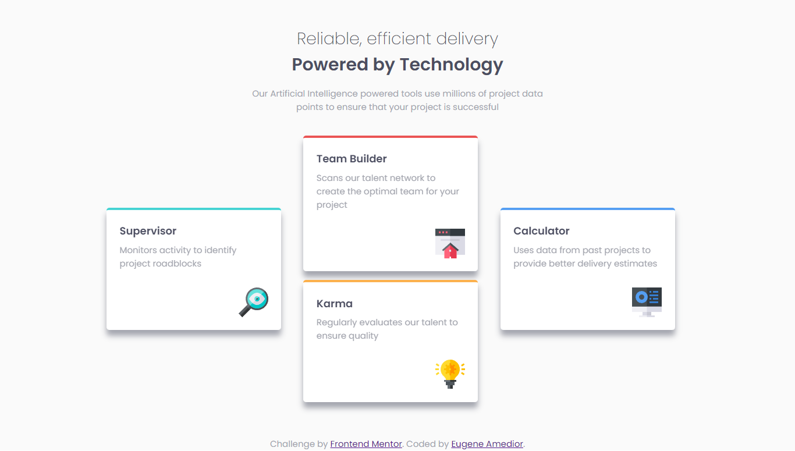

# Frontend Mentor - Four card feature section solution

This is a solution to the [Four card feature section challenge on Frontend Mentor](https://www.frontendmentor.io/challenges/four-card-feature-section-weK1eFYK). Frontend Mentor challenges help you improve your coding skills by building realistic projects. 

## Table of contents

- [Overview](#overview)
  - [The challenge](#the-challenge)
  - [Screenshot](#screenshot)
  - [Links](#links)
- [My process](#my-process)
  - [Built with](#built-with)
  - [What I learned](#what-i-learned)
  - [Continued development](#continued-development)
  - [Useful resources](#useful-resources)
- [Author](#author)

## Overview

### The challenge

Users should be able to:

- View the optimal layout for the site depending on their device's screen size

### Screenshot

### Links

- Solution URL: [GitHub](https://github.com/Eugene-ak/four-card-feature-section.git)
- Live Site URL: [https://four-card-feature-section-seven-lake.vercel.app/](https://four-card-feature-section-seven-lake.vercel.app/)

## My process

### Built with

- Semantic HTML5 markup
- Flexbox
- CSS Grid
- Desktop-first workflow
- [React](https://reactjs.org/) - JS library
- [Vite](https://vitejs.dev/guide/) - React framework
- [Sass](https://sass-lang.com/) - For styles

### What I learned

I learnt to use css grid to determine layouts of elements on website and how to position children within elements.

### Continued development

Css grid allows developers to build two-dimensional layouts unlike flexbox and this is a very helpful feature in css. It also avoids extra markup to serve as containers for elements. Moving forward, I think using grid is appropriate for planning and handling layouts.

## Author

- Website - [Eugene K. S. Amedior](https://portfolio-website-27ll.onrender.com/)
- Frontend Mentor - [@Eugene-ak](https://www.frontendmentor.io/profile/Eugene-ak)
